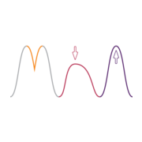
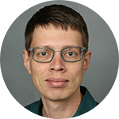

---
# the default layout is 'page'
icon: fas fa-users
order: 2
title: "Meet the team"
---

Any questions? Drop us a mail at [youngresearchersarch@gmail.com](mailto:youngresearchersarch@gmail.com)

 
  

  
  

  

  **Sinem Hacıosmanoğlu** (Universität Tübingen)  
  Sinem is a PhD candidate at the University of Tübingen, Germany, Department of Geoscience, Institute for Archeological Sciences. She completed her bachelor (BA) and master (MSc) at Istanbul Technical University (Turkey) in the Department of Geological Engineering. In her PhD project, she investigates clay resources and ancient ceramics from the Late Bronze Age and the Iron Age in Cilicia, Southeast Anatolia, Eastern Mediterranean by using several disciplines, such as mineralogy, petrography, geochemistry and field geology. The project is funded by the Swiss National Science Foundation (SNF). In addition, she is working as a research assistant on several projects funded by the German Research Foundation (DFG) and hosted at the Competence Center Archaeometry - Baden-Württemberg (CCA-BW). 
  

 
  

  
  

  

  **Baptiste Solard** (Universität Tübingen)  
  Baptiste completed his Diplôme d’ingénieur chimiste (BSc and MSc equivalent) in Material Sciences at the National Chemistry School of Montpellier, France (ENSCM) in November 2019. In October 2021, he successfully finished his master of Archaeological Sciences with specialisation in archaeometry (MSc) at the University of Tübingen (Germany), Department of Geoscience, Institute for Archeological Sciences with a thesis on Atticising Black Gloss ceramics from the 4th century BCE. Since December 2019, he is a research assistant at the Competence Center Archaeometry – Baden-Württemberg (CCA-BW), working in various projects on ancient ceramic technology. In 2023, he will start his PhD at the University of Tübingen on Merovingian pigmented glass production in Switzerland. 
  

 
  

  
  

  

  **Thomas Rose** (Goethe-Universität Frankfurt)  
  Thomas is a coordinator in the NDFI4Earth at Goethe University Frankfurt, PhD student at Ben-Gurion University of the Negev and La Sapienza - Universitá di Roma within the MSCA-ITN Project ED-ARCHMAT, and visiting scientist of the Deutsches Bergbau-Museum Bochum. He gained expertise in ancient copper smelting technologies and stable metal isotopes. In addition, he is member of the GlobaLID Core Team and developer of the R package ChronochRt. More info at [copper-smelting.com](https://copper-smelting.com/).
  

