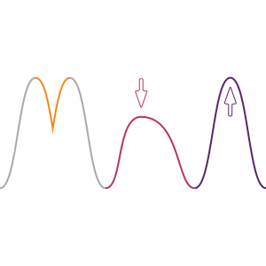

---
# the default layout is 'page'
icon: fas fa-users
order: 2
title: "Meet the team"
---

 
  

  
  

  

  **Sinem Hacıosmanoğlu** (Universität Tübingen)  
  Sinem is ... 
  

 
  

  
  

  

  **Baptiste Solard** (Universität Tübingen)  
  Baptiste is ... 
  

 
  

  
  

  

  **Thomas Rose** (Goethe-Universität Frankfurt)  
  Thomas is a coordinator in the NDFI4Earth at Goethe University Frankfurt, PhD student at Ben-Gurion University of the Negev and La Sapienza - Universitá di Roma within the MSCA-ITN Project ED-ARCHMAT, and visiting scientist of the Deutsches Bergbau-Museum Bochum. He gained expterise in ancient copper smelting technologies and stable metal isotopes. In addition, he is member of the GlobaLID Core Team and developer of the R package ChronochRt. More info at [copper-smelting.com](https://copper-smelting.com/).
  

