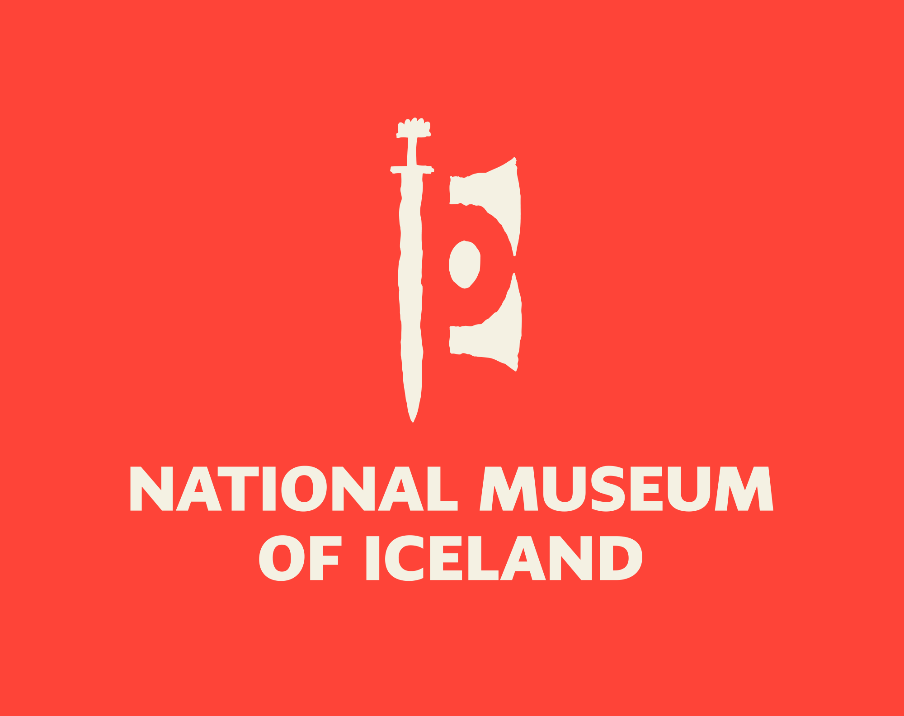
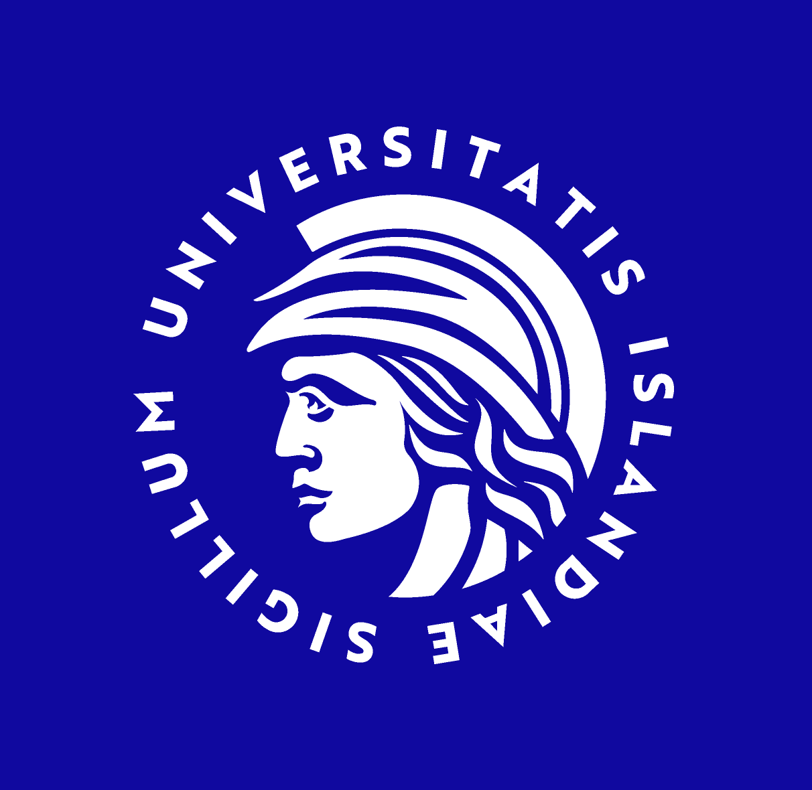
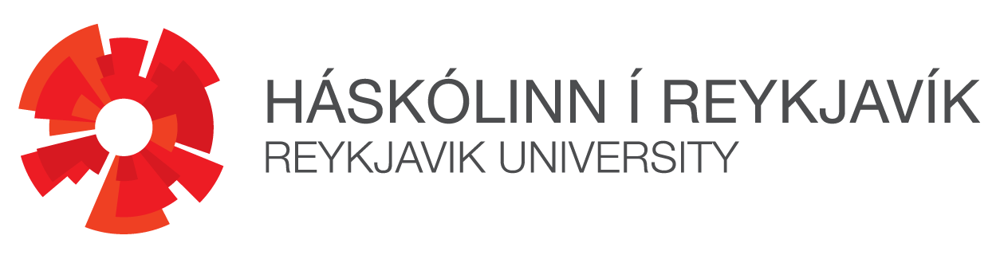
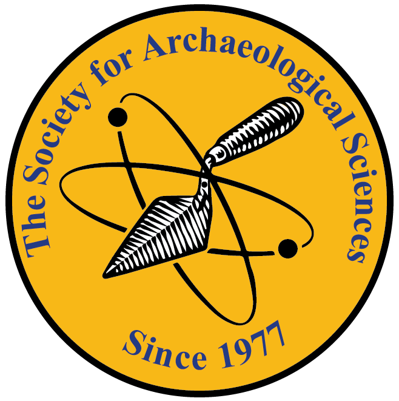
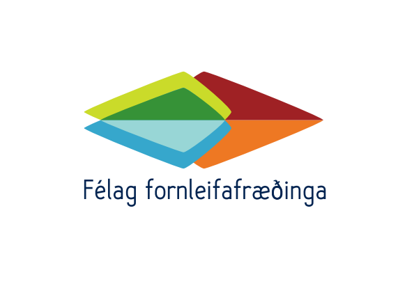
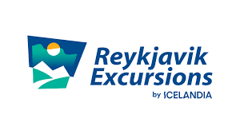

::: {.callout-note}
## YRA2026 Key dates
**March 1^st^** -- [Abstract submission](https://forms.gle/pUR3Cq5sZAgNfRSb7) opens  
**May 1^st^** -- Deadline for [abstract submission](https://forms.gle/pUR3Cq5sZAgNfRSb7)  
<!-- **May 15^th^** -- **EXTENDED** Deadline for [abstract submission](https://forms.gle/pUR3Cq5sZAgNfRSb7)  -->
**June 15^th^** -- Announcement of abstracts decisions  
**June 15^th^** -- [Registration](https://forms.gle/CCEFcsETfG1rPqsQ9) opens  
**Aug 1^st^** -- [Registration](https://forms.gle/CCEFcsETfG1rPqsQ9) closes **for presenters**  
**Aug 15^th^** -- Preliminary program available  
**Sept 1^st^** -- [Registration](https://forms.gle/CCEFcsETfG1rPqsQ9) closes **for participants**  
**Oct 1^st^** -- Meeting details and final program available  
**Oct 28^th^ -- 30^th^** -- YRA2026 in Reykjavik  
**Nov 15^th^** -- Certificates sent to participants  

:::

## General information 

:::: {.column-margin}
Hosted at:   
&nbsp;  

Organised by:  

[{width=50% fig-align="center"}](https://english.hi.is/)  

  

&nbsp;  

Sponsored by:

[{width=50% fig-align="center"}](https://socarchsci.org)  

Organised by:  
[Maren von Mallinckrodt](team.qmd#maren-von-mallinckrodt)  
[Joe W. Walser III](team.qmd#joe-walser-iii)  
[Cecilia Collins](team.qmd#cecilia-rose-collins)  
[Enrique Fernández-Palacios](team.qmd#enrique-fernández-palacios)  
[Paola Pizzo](team.qmd#paola-pizzo)  
[Vasiliki Anevlavi](team.qmd#vasiliki-anevlavi)  
[Justina Stonytė](team.qmd#justina-stonytė)  
[Poorva Salvi](team.qmd#poorva-salvi)  

::::

We are happy to announce that the 9th Workshop Young Researchers in Archaeometry will be held in the National Museum of Iceland in Reykjavík. The conference will be held in person from 28^th^ to 30^th^ of October 2026 and will welcome early career researchers (masters, PhD, post-docs up to six years after their PhD) in archaeological sciences and cultural heritage studies. 

With this workshop, we aim to offer a relaxed atmosphere to encourage interdisciplinary exchange between early career researchers. We are pleased to invite you for oral and poster contributions in all fields of natural sciences about archaeological and anthropological topics. In particular, early career researchers in archaeology, art history, anthropology, biological anthropology, environmental archaeology, chemistry, conservation, cultural heritage, earth science, and material science are welcome to submit an abstract for an oral presentation or poster. 

Send us your abstract (max. 200 words) until **May 1^st^, 2026** via the [submission form](https://forms.gle/pUR3Cq5sZAgNfRSb7).  

More information and a first program with information about the social events will follow soon. 

<!-- 
## Registration
Please register through [this form](https://forms.gle/vJCm7feYgBijP4FGA). Registration is possible for everyone, also if you are not presenting. Workshop fees are 30 €. SAS members receive a 5 € discount; you can join SAS before 15 September to benefit from the discount. 
-->

<!-- Abstract submission is closed. The submitted abstracts are now evaluated. -->

## SAS Travel Award 

The [Society for Archaeological Sciences](https://socarchsci.org) (SAS) sponsors a single travel award of USD 250 to support one student/ECR from [low and middle income countries](https://datahelpdesk.worldbank.org/knowledgebase/articles/906519-world-bank-country-and-lending-groups) and/or with financial need. 

The application for the SAS Travel award is integrated in the [abstract submission form](https://forms.gle/pUR3Cq5sZAgNfRSb7). Applications will be evaluated after abstract submission closed. The evaluation will be based on the applicant's career status, location of affiliation, availability of alternative funding sources, and a motivation letter of 200 to 250 words. The SAS Travel Award will only be bestowed to an applicant with an abstract accepted for presentation at YRA2026. 

# How to get to the venue

## Venue
The conference is hosted by the [National Museum of Iceland (Suðurgata 41, 102 Reykjavík)](https://maps.app.goo.gl/MwwsrAMZHbqqbpPv7). 

It is easily accessible by walk from the city center and by bus. The closest bus stops are Háskóli Íslands and Þjóðminjasafn. Bus tickets are purchased via the [Klappið app](https://www.klappid.is/en), which also functions as a journey planner and allows you to organize your transportation within the city. 

The conference will be held in the lecture hall located in the National Museum, right next to the museum’s café. 

## Travel to Reykjavik

[Keflavík International Airport](https://www.kefairport.com/) connects Iceland with most of the major European cities and major airports in the US and Canada. The most convenient option to get from the international airport to the city center of Reykjavík is the [Flybus](https://www.re.is/tour/flybus/), which takes you to Reykjavík in around 45 minutes. As of February 2026, a single journey costs 3,999 ISK (~ 27 EUR / 32 USD / 24 GBP). Tickets can be purchased [online](https://www.re.is/tour/flybus/) or at the airport. A 20% discount code is available for all workshop presenters. The code will be shared shortly before the workshop and is valid until 7^th^ of November 2026. The discount code is valid for online bookings only. It must not be shared with anyone else! 

<!-- The text blocks below can be used as template for upcoming announcements -->

<!--
## Program

Oral presentations will be 20 minutes with time for discussion included. Posters should have size A0 in portrait format (width: 841 mm, height: 1189 mm). 

All times are given in Central European Time (UTC+2). 

[You can convert to your local time zone with, e.g., [timeanddate.com](https://www.timeanddate.com/worldclock/converter.html?iso=20231004T090000&p1=37).]{.aside}

::: {.panel-tabset}

## **Oct. 3^rd^**

|||
|--|--------|
|20:00|Icebreaker *[Ratskeller](https://maps.app.goo.gl/yMbpg2o1NwAJbnCU7) (Haaggasse 4, 72070 Tübingen)*|

## **Oct. 4^th^**

|||
|--|--------|
|08:30 -- 09:00|Welcoming and registration|
|09:00 -- 09:15|Opening|
|09:15 -- 09:50|Keynote: **Susanne Greiff** *TBA*|
|||
|09:50 -- 10:10|*Coffee break*|
|||
||**Session 1: Ceramics I and Architecture**|
|10:10 -- 10:30|[*Tracing the cultural and trade relations of the Spanish Empire and the Lesser Caribbean Antilles in the 16^th^ and 17^th^ centuries through ceramic analysis*](abstracts/2024-.qmd) **Sonia Pujals Blanch**, Jaume Buxeda i Garrigós, Roberta  Mentesana|

:::
-->

<!--
## Save the date! 

YRA2026 will be hosted by the National Museum of Iceland in Reykjavik (Iceland) from 28 to 30 October 2026. More information will follow soon. 
-->
