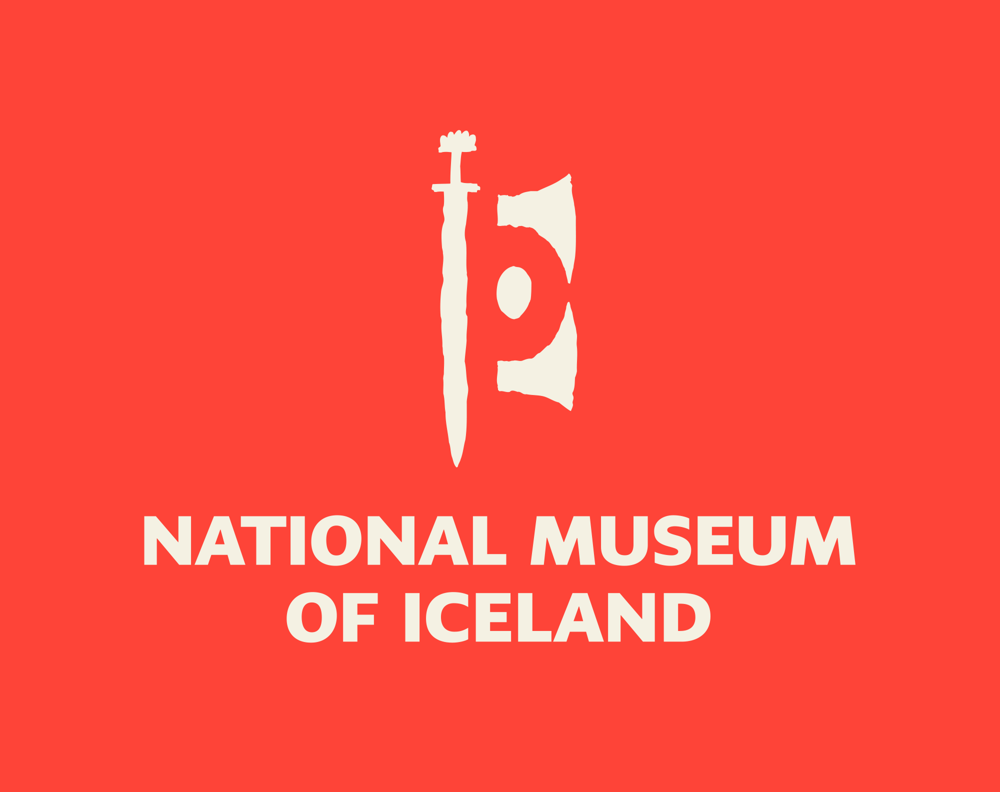
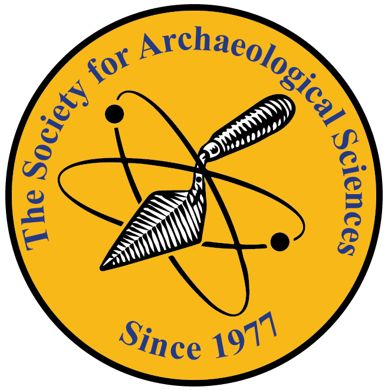
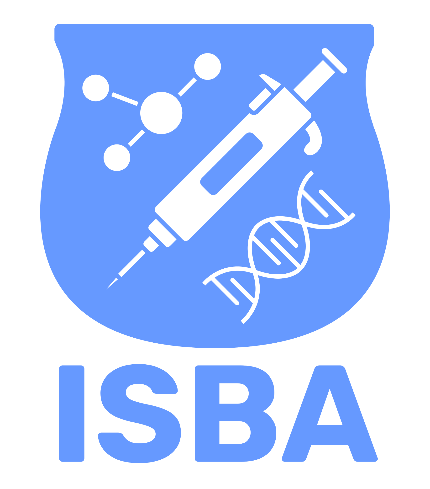
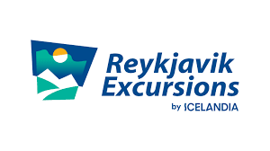
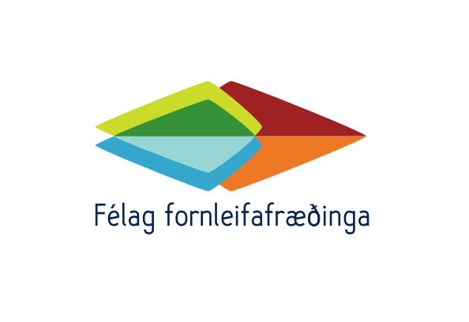

::: {.callout-note}
## YRA2026 Key dates
~~**March 1^st^** -- [Abstract submission](https://forms.gle/pUR3Cq5sZAgNfRSb7) opens~~  
<!-- **May 1^st^** -- Deadline for [abstract submission](https://forms.gle/pUR3Cq5sZAgNfRSb7)  -->
~~**May 15^th^** -- **EXTENDED** Deadline for [abstract submission](https://forms.gle/pUR3Cq5sZAgNfRSb7)~~  
~~**June 15^th^** -- Announcement of abstracts decisions~~  
~~**June 15^th^** -- [Registration](https://forms.gle/CCEFcsETfG1rPqsQ9) opens~~  
~~**Aug 1^st^** -- [Registration](https://forms.gle/CCEFcsETfG1rPqsQ9) closes **for presenters**~~  
~~**Aug 15^th^** -- Preliminary program available~~  
~~**Sept 1^st^** -- [Registration](https://forms.gle/CCEFcsETfG1rPqsQ9) closes **for participants**~~  
**Oct 1^st^** -- Meeting details and final program available  
**Oct 28^th^ -- 30^th^** -- YRA2026 in Reykjavik  
**Nov 15^th^** -- Certificates sent to participants  

:::

## General information 

:::: {.column-margin}
Hosted at:   
&nbsp;  

<!--
Organised by:  

...

&nbsp;  
-->

Sponsored by:

::: {layout="[ 50 , 50 ]"}

::: {#column-image}
[{width=50% fig-align="center"}](https://socarchsci.org)  
:::

::: {#column-image}

:::

:::

&nbsp;  

Supported by:

Organised by:  
[Maren von Mallinckrodt](team.qmd#maren-von-mallinckrodt)  
[Joe W. Walser III](team.qmd#joe-walser-iii)  
[Cecilia Collins](team.qmd#cecilia-rose-collins)  
[Enrique Fernández-Palacios](team.qmd#enrique-fernández-palacios)  
[Paola Pizzo](team.qmd#paola-pizzo)  
[Vasiliki Anevlavi](team.qmd#vasiliki-anevlavi)  
[Justina Stonytė](team.qmd#justina-stonytė)  
[Poorva Salvi](team.qmd#poorva-salvi)  

::::

We are happy to announce that the 9th Workshop Young Researchers in Archaeometry will be held in the National Museum of Iceland in Reykjavík. The conference will be held in person from 28^th^ to 30^th^ of October 2026 and will welcome early career researchers (masters, PhD, post-docs up to six years after their PhD) in archaeological sciences and cultural heritage studies. 

With this workshop, we aim to offer a relaxed atmosphere to encourage interdisciplinary exchange between early career researchers. We are pleased to invite you for oral and poster contributions in all fields of natural sciences about archaeological and anthropological topics. In particular, early career researchers in archaeology, art history, anthropology, biological anthropology, environmental archaeology, chemistry, conservation, cultural heritage, earth science, and material science are welcome to submit an abstract for an oral presentation or poster. 

<!--
Send us your abstract (max. 200 words) until **May 15^th^, 2026** via the [submission form](https://forms.gle/pUR3Cq5sZAgNfRSb7).  

More information and a first program with information about the social events will follow soon. 
-->

## Registration and fees
Please register through [this form](https://forms.gle/vJCm7feYgBijP4FGA). Workshop fees are 60 € and SAS members receive a 5 € discount. You can join SAS before September 1^st^ to benefit from the discount. You can participate in the workshop also if you are not presenting. 

<!-- 
## Registration
Please register through [this form](https://forms.gle/vJCm7feYgBijP4FGA). Workshop fees are 60 € and SAS members receive a 5 € discount. You can join SAS before September 1^st^ to benefit from the discount. You can participate in the workshop also if you are not presenting. 
-->

<!-- Abstract submission is closed. The submitted abstracts are now evaluated. -->

## Program

Oral presentations will be 20 minutes with time for discussion included and poster pitches will be 5 min. Posters should have size A0 in portrait format (width: 841 mm, height: 1189 mm). 

All times are given in Greenwich Meridian Time (UTC+0). 

[You can convert to your local time zone with, e.g., [timeanddate.com](https://www.timeanddate.com/worldclock/converter.html?iso=20261028T090000&p1=211).]{.aside}

::: {.panel-tabset}

## **Oct. 27^th^**

|||
|--|--------|
|20:00|Icebreaker *[Lebowski Bar](https://www.lebowskibar.is/)* ([Laugavegur 20a, 101 Reykjavik](https://maps.app.goo.gl/7LCE8YX4j5DumjjS8); self-paid)|

## **Oct. 28^th^**

|||
|--|--------|
|10:00 -- 10:15|Opening|
|10:15 -- 11:00|Keynote: **Adam N. Zimmer** (University of Iceland) *A Biocultural Study of Human Remains in the Læknagarður Anatomical Collection*|
|||
|11:00 -- 11:20|*Coffee break*|
|||
||**Session 1: Bioarchaeology**|
|11:20 -- 11:40|*Dietary responses to environmental and cultural changes: compound-specific isotope evidence from Epipaleolithic L'Aven des Iboussières (France)* **Timon Zirlewagen** (Institute for Archaeological Sciences, Department of Geosciences, University of Tübingen, Germany)|
|11:40 -- 12:00|*Developing a baseline to achieve greater mobility granularity within a historic wetland landscape (Nene Valley, Northamptonshire, Britain 4th-6th CE)* **Alvaro Felipe Ortega González** (School of Heritage and Culture, University of Leicester, United Kingdom)|
|12:00 -- 12:20|*Shaping Little Lives: Bioarchaeological Insights into Childhood at Biniadrís Cave during Late Bronze Age Menorca, Spain* **Michelle Pfeiffer** (Institute for Archaeological Sciences, Department of Geosciences, University of Tübingen, Germany)|
|||
|12:20 -- 13:30|*Lunch break*|
|||
||**Session 2: Landscape- and Zooarchaeology I**|
|13:30 -- 13:50|*Taphonomic mineralisations with a view to environment and timeline information* **Charlotte Loy** (Faculty of Natural Sciences, Keele University, Stoke on Trent, UK)|
|13:50 -- 14:10|*Investigating Neolithic subsistence at Gadachrili Gora (Georgia, South Caucasus): zooarchaeological analysis and a multi-isotope approach (preliminary study)* **Ana Davitashvili** (Department of Bioarchaeology, Faculty of Archaeology, University of Warsaw, Poland)|
|14:10 -- 14:30|*Equid Eating: Isotopic Analysis Insights from Palaeolithic Wild Horses in the Pyrenees* **Jett Liska** (Institute for Archaeological Sciences, Department of Geosciences, University of Tübingen, Germany)|
|||
|14:30 -- 14:50|*Coffee break*|
|||
||**Session 3: Landscape- and Zooarchaeology II**|
|14:50 -- 15:10|*Archaeobotanical Studies from the Hellenistic to Roman Island of Tinos (Cyclades, Greece)* **Thorsten Jakobitsch** (Austrian Archaeological Institute, Austrian Academy of Sciences, Vienna, Austria)|
|15:10 -- 15:30|*Investigating Paleoenvironmental Dynamics and Sustainability during the Classic Maya “Collapse” Using Multi-Proxy Zooarchaeological Stable Isotopic Analysis* **Yifan Wang** (Department of Anthropology, University of Illinois at Urbana-Champaign, Urbana, Illinois, USA)|

## **Oct. 29^th^**

|||
|--|--------|
|10:00 -- 13:00|*Guided tour through the National Museum of Iceland; lunch*|
|||
||**Session 4: Landscape- and Zooarchaeology: Iceland**|
|13:00 -- 13:20|*The Palaeoecology of Birch Woods in Iceland* **Didrik Tveit** (University of Iceland, Reykjavík, Iceland)|
|13:20 -- 13:40|*Soil, seeds and shielings: The palaeoecology of transhumance in Iceland* **Snædís Sunna Thorlacius** (Faculty of Life and Environmental Sciences, University of Iceland, Reykjavík, Iceland)|
|13:40 -- 14:00|*From Cetaceans to Artefacts. Whale Bone Analysis for Understanding Early Coastal Settlements in Iceland and Northern Norway* **Valerio Punzi** (University of Oslo, Norway; University of Iceland, Reykjavík, Iceland)|
|||
|14:00 -- 14:20|*Coffee break*|
|||
||**Session 5: Lithics and Mortars I**|
|14:20 -- 14:40|*Preliminary Characterisation Results of Roman Concrete from the Podium Temple in Antioch on the Orontes* **Kutsi Akcicek** (Department of Engineering Science, University of Oxford, United Kingdom)|
|14:40 -- 15:00|*Small Datasets and Big Questions on Marble Networks in Roman Southeastern Thrace* **Vasiliki Anevlavi** (National Hellenic Research Foundation, Athens, Greece; Austrian Archaeological Institute, Austrian Academy of Sciences, Vienna, Austria)|
|15:00 -- 15:20|*Plastering Church II: socioeconomical aspects of plaster production from Mikulčice stronghold (Czech Republic)* **Paola Pizzo** (Centre for Multidisciplinary Archaeology, Institute of Archaeology, Czech Academy of Sciences, Brno, Czech Republic)|
|15:20 -- 15:40|*The slag, extra slag and some more slag from the Slag heap of Cerro de los Almadenes, Spain* **Anna-Maria Sdralia** (Department of Prehistory and Archaeology, University of Granada, Granada, Spain)|
|||
|15:40 -- 16:00|*Coffee break*|
|||
||**Session 6: Lithics and Mortars II**|
|16:00 -- 16:20|*Whole Rock Analysis of Southeast Arabian Chlorite Schists: Insights from WDXRF and LA-ICP-MS* **John Shannon** (Johns Hopkins University, Baltimore, Maryland, United States)|
|16:20 -- 16:40|*Quantifying Authorship: 3D Surface Metrology for Identifying Individual Practice in Magdalenian Mammoth Engravings from Gönnersdorf (Germany, ca. 15,800 BP)* **Hanna McNulty** (Department of Archaeology, Durham University, United Kingdom)|
|19:30|Conference Dinner *[LeKocK](https://www.lekock.is/)* ([Tryggvagata 12, 101 Reykjavik](https://maps.app.goo.gl/vekXgGBmc7s8pWv76); self-paid)|

## **Oct. 30^th^**

|||
|--|--------|
||**Session 7: Ceramics I**|
|10:00 -- 10:20|*Petrography online! Integration of petrographic ceramic data in the SEAD infrastructure* **Athena Konstandara** (Department of Historical, Philosophical and Religious Studies, Umeå University, Umeå, Sweden)|
|10:20 -- 10:40|*Archaeometric Analysis on Archival Ceramics: A look at the Woolley Collection from Alalakh at the Ashmolean Museum* **Mikayla Noel Coad** (University of Oxford, United Kingdom)|
|10:40 -- 11:00|*Mineralogical and Chemical Analysis and Comparison of Dark Faced Ware Dating to the Amuq B and C Periods at Tell Kurdu* **Zeynep Tok** (Archaeology & History of Art, The Graduate School of Social Sciences and Humanities, Koç University, İstanbul, Türkiye)|
|||
|11:00 -- 11:20|*Coffee break*|
|||
||**Session 8: Ceramics II**|
|11:20 -- 11:40|*Characterization Techniques of Clays for the provenance study of ancient ceramics: A case study from Rakhigarhi (India)* **Amit Ranjan** (Ashoka University, Sonipat, Haryana, India)|
|11:40 -- 12:00|*New Compositional Data from Hopo, Papua New Guinea: Temper Analysis and the Debate Over Gulf Pottery Manufacture* **Sarah Macindoe-Baker** (Geology Department, University of Otago, Dunedin, New Zealand; Archaeology Programme, University of Otago, Dunedin, New Zealand)|
|12:00 -- 12:20|*Analytical Limitations and Research Gaps in South Asian Archaeometry: A Case Study from Pakistan* **Muhammad Tehmash Khan** (The Aga Khan University, Karachi, Pakistan)|
|||
|12:20 -- 13:30|*Lunch break*|
|||
||**Poster pitches**|
|13:30 -- 13:35|*The Apulean warrior through armor and ceramics* **Rita Solazzo** (Université Paris 1 Panthèon Sorbonne, Paris, France; Université Bordeaux Montaigne, Bodeaux, France)|
|13:35 -- 13:40|*Re-categorisation patina on lithics based on XRF data* **Tiberius Bateman** (Faculty of Archaeological Science, Leiden University, The Netherlands)|
|13:40 -- 13:45|*From seals to SEAD: incorporating mammal bones into a database* **Victoria McKee** (Department of Historical, Philosophical and Religious Studies, Umeå University, Sweden)|
|13:45 -- 13:50|*Exploring the purpose of suspected intoxicant paraphernalia from La Hueca-Sorcé (Puerto Rico) with a non-destructive, multianalytical approach* **Judith Margarita López Aceves** (University of Leicester, United Kingdom)|
|13:50 -- 13:55|*Combined Scientific Dating and Materials Analysis of Salisbury Cathedral, United Kingdom* **Kutsi Akcicek** (Department of Engineering Science, University of Oxford, United Kingdom)|
|13:55 -- 14:00|*Multidisciplinary pXRF Research in the Campiglia Marittima Mining District (Tuscany, Italy): Reconstructing the Diachronic Production History of the Madonna di Fucinaia Site* **Niccolò Parnetti** (Department of History Sciences and Cultural Heritage/Archaeology/University of Siena, Italy)|
|||
|14:00 -- 15:30|**Posters session** with *coffee break*|
|15:30 -- 15:45|Travel award ceremony, closing|

:::

## SAS Travel Award 

The [Society for Archaeological Sciences](https://socarchsci.org) (SAS) sponsors a single travel award of USD 250 to support one student/ECR from [low and middle income countries](https://datahelpdesk.worldbank.org/knowledgebase/articles/906519-world-bank-country-and-lending-groups) and/or with financial need. 

<!--
The application for the SAS Travel award is integrated in the [abstract submission form](https://forms.gle/pUR3Cq5sZAgNfRSb7). Applications will be evaluated after abstract submission closed. The evaluation will be based on the applicant's career status, location of affiliation, availability of alternative funding sources, and a motivation letter of 200 to 250 words. The SAS Travel Award will only be bestowed to an applicant with an abstract accepted for presentation at YRA2026. 
-->

# How to get to the venue

## Venue
The conference is hosted by the [National Museum of Iceland (Suðurgata 41, 102 Reykjavík)](https://maps.app.goo.gl/MwwsrAMZHbqqbpPv7). 

It is easily accessible by walk from the city center and by bus. The closest bus stops are Háskóli Íslands and Þjóðminjasafn. Bus tickets are purchased via the [Klappið app](https://www.klappid.is/en), which also functions as a journey planner and allows you to organize your transportation within the city. 

The conference will be held in the lecture hall located in the National Museum, right next to the museum’s café. 

## Travel to Reykjavik

[Keflavík International Airport](https://www.kefairport.com/) connects Iceland with most of the major European cities and major airports in the US and Canada. The most convenient option to get from the international airport to the city center of Reykjavík is the [Flybus](https://www.re.is/tour/flybus/), which takes you to Reykjavík in around 45 minutes. As of February 2026, a single journey costs 3,999 ISK (~ 27 EUR / 32 USD / 24 GBP). Tickets can be purchased [online](https://www.re.is/tour/flybus/) or at the airport. A 20% discount code is available for all workshop presenters. The code will be shared shortly before the workshop and is valid until 7^th^ of November 2026. The discount code is valid for online bookings only. It must not be shared with anyone else! 

<!-- The text blocks below can be used as template for upcoming announcements -->

<!--
## Program

Oral presentations will be 20 minutes with time for discussion included. Posters should have size A0 in portrait format (width: 841 mm, height: 1189 mm). 

All times are given in Central European Time (UTC+2). 

[You can convert to your local time zone with, e.g., [timeanddate.com](https://www.timeanddate.com/worldclock/converter.html?iso=20231004T090000&p1=37).]{.aside}

::: {.panel-tabset}

## **Oct. 3^rd^**

|||
|--|--------|
|20:00|Icebreaker *[Ratskeller](https://maps.app.goo.gl/yMbpg2o1NwAJbnCU7) (Haaggasse 4, 72070 Tübingen)*|

## **Oct. 4^th^**

|||
|--|--------|
|08:30 -- 09:00|Welcoming and registration|
|09:00 -- 09:15|Opening|
|09:15 -- 09:50|Keynote: **Susanne Greiff** *TBA*|
|||
|09:50 -- 10:10|*Coffee break*|
|||
||**Session 1: Ceramics I and Architecture**|
|10:10 -- 10:30|[*Tracing the cultural and trade relations of the Spanish Empire and the Lesser Caribbean Antilles in the 16^th^ and 17^th^ centuries through ceramic analysis*](abstracts/2024-.qmd) **Sonia Pujals Blanch**, Jaume Buxeda i Garrigós, Roberta  Mentesana|

:::
-->

<!--
## Save the date! 

YRA2026 will be hosted by the National Museum of Iceland in Reykjavik (Iceland) from 28 to 30 October 2026. More information will follow soon. 
-->
