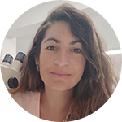
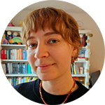
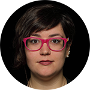

## Baptiste Solard 

::: {layout="[ 25 , 75 ]"}

::: {#column-image}

:::

::: {#column-text}
Baptiste (Universität Tübingen) completed his Diplôme d’ingénieur chimiste (BSc and MSc equivalent) in Material Sciences at the National Graduate School of Chemistry of Montpellier, France (ENSCM) in November 2019. In October 2021, he successfully finished his master of Archaeological Sciences with specialisation in archaeometry (MSc) at the University of Tübingen (Germany), Department of Geoscience, Institute for Archeological Sciences with a thesis on Atticising Black Gloss ceramics from the 4^th^ century BCE. Since December 2019, he is a research assistant at the Competence Center Archaeometry - Baden-Württemberg (CCA-BW), working in various projects on ancient ceramic technology. In April 2023, he started his PhD at the University of Tübingen on Merovingian opaque coloured glass production in Zürich, Switzerland. 
:::

:::

## Cecilia Rose Collins 
::: {layout="[ 25 , 75 ]"}

::: {#column-image}

:::

::: {#column-text}
Cecilia is a Postdoctoral Research Associate at the Institute for Biomedical and Neural Engineering, Reykjavík University. She currently holds a postdoctoral grant awarded by Rannís, the Icelandic Centre for Research, which aims to advance lab-based 3D and microscopic methods in archaeological science in Iceland.
:::

:::

## Enrique Fernández-Palacios 
::: {layout="[ 25 , 75 ]"}

::: {#column-image}

:::

::: {#column-text}
Enrique holds a Degree in Archaeology by Universidad Complutense de Madrid (Spain) and specialized in geoarchaeology and archaeometry after completing a MSc in Archaeological Sciences at University of Tübingen (Germany). Since then, he has continued his research in geoarchaeology focusing on analytical techniques such as soil micromorphology, lipid biomarker analysis, and phytolith analysis, which he applied for his PhD project carried out at the University of La Laguna (Spain). As member of the Archaeological Micromorphology and Biomarkers (AMBI) Lab research group, his doctoral dissertation focused on the study of pastoral activities conducted by the indigenous communities of La Palma (Canary Islands) from a geoarchaeological and biomolecular perspective. Currently, he holds a postdoc position at Kiel University (Germany) as a member of the Ethnomicroarchaeology (EMA) Lab research group.
:::

:::

## Joe Walser III 
::: {layout="[ 25 , 75 ]"}

::: {#column-image}

:::

::: {#column-text}
Joe completed a BA in Anthropology at Temple University, MSc in Palaeopathology at Durham University and PhD in Archaeology at the University of Iceland. He works as Curator of Physical Anthropology at the National Museum of Iceland. Joe also teaches the courses Human Osteology and Introduction to Collection Management at the University of Iceland. Joe‘s research interests include human osteology, bioarchaeology, medical history, museum studies and archaeometry.
:::

:::

## Justina Stonytė 
::: {layout="[ 25 , 75 ]"}

::: {#column-image}

:::

::: {#column-text}
Justina (Center for Physical Sciences and Technology, Lithuania) is a PhD candidate in Chemistry. Her doctoral research, titled “Uncovering Chemical Fungal Footprints in Archaeological Samples” bridges molecular biology, electrochemistry, and bioarchaeology. Her work aims to develop innovative analytical methods for heritage science and to shed light on the overlooked relationships between humans and fungi in the past.
:::

:::

## Kyriaki Tsirtsi 

::: {layout="[ 25 , 75 ]"}

::: {#column-image}

:::

::: {#column-text}
Kyriaki (Cyprus Institute) has extensive experience in archaeobotanical research, both in the field and in the laboratory. For her PhD research, defended in November 2022, Kyriaki combined different archaeobotanical and scientific techniques in understanding the agricultural and domestic economies of Classical Sikyon (Greece). During her PhD studies, she was fully embedded in the field team, designing recovery protocols, supervising recovery in the field, and analysing resulting material, thereby becoming an expert in the flora of the Aegean and the current models of the economy and social organization of the first millennium BCE. 

Throughout her PhD studies she was also awarded two Erasmus+ Programs; one took place in 2018, in the School of Archaeology of the University of Oxford and the second in 2021 in the Humana, IMF-SCIC Institute, in Barcelona. Both Erasmus programs focused on microbotanical studies and specifically the analysis of starch granules retrieved from the interior of ceramic pots, in order to reconstruct cooking and consumption patterns in the 1st millennium BCE in Greece. She has also held the British School of Athens Centenary Bursary in order to conduct similar research in Oxford related to the Keros research and excavation project of the University of Cambridge (2019). 

In MedisFood, Kyriaki holds a Post-Doctorate position where she explores the long durée of plant choices of the 3^rd^/2^nd^ millennium BCE, the varieties of grapes and olives exploited in the biggest islands of the Eastern Mediterranean, Crete and Cyprus, and addresses key questions related to the rise of complex societies in both islands. The simultaneous analysis of both islands allows not only the understanding of the unique social and agricultural structures of each island, but also the definition of patterns and tendencies that may have appeared at the same time on both regions and which may reflect adaptations, influences and ultimately connections with other areas, or even directly between Crete and Cyprus. 
:::

:::

## Maren von Mallinckrodt 
::: {layout="[ 25 , 75 ]"}

::: {#column-image}

:::

::: {#column-text}
Maren is a PhD candidate in Biological Anthropology at the University of Iceland. She completed her BA in Pre- and Protohistoric Archaeology at the University of Heidelberg (Germany) in 2023. In 2025, she graduated with a MA in Historical Archaeology at the School of Humanities, University of Iceland, where her thesis focused on reconstructing physical activity in non-adult skeletal remains from two archaeological sites in historical Iceland. Maren started her PhD project in August 2025 at the School of Social Sciences at the University of Iceland under the supervision of Prof. Agnar Helgason. Her doctoral research examines non-adult skeletons from several medieval Icelandic sites using macroscopic and biomolecular approaches, with the aim of addressing questions related to health, mortality, and social identity among infants and children in historical Iceland.
:::

:::

## Paola Pizzo 
::: {layout="[ 25 , 75 ]"}

::: {#column-image}

:::

::: {#column-text}
Paola (Czech Academy of Sciences) is a postdoctoral researcher at the Institute of Archaeology (Brno) and at the Institute of Theoretical and Applied Mechanics of the Czech Academy of Sciences. After completing her BA and MA in Archaeology at the University of Turin (Italy), she joined the Marie Skłodowska-Curie doctoral network “PlaCe-ITN” as a PhD candidate. Her PhD (Charles University, Czech Republic) focused on plaster production in the Paphos district (Cyprus) between the Late Bronze Age and the Roman period. After obtaining her PhD in early 2025, she began working as a postdoctoral researcher at the Czech Academy of Sciences focusing on various projects concerning plasters and mortars across the Czech Republic. 
:::

:::

## Poorva Salvi 
::: {layout="[ 25 , 75 ]"}

::: {#column-image}

:::

::: {#column-text}
Poorva is a PhD scholar at the Archaeological Sciences Centre, Indian Institute of Technology (IIT) Gandhinagar, India. Her research operates at the intersection of Archaeology and Digital Humanities, with a focus on integrating cutting-edge technology into heritage studies. She is exploring the iconometry and iconography of Badami Chalukyan (6th–8th CE) and Hoysala (10th–13th CE) sculptures from Karnataka, India, through a digital lens. By employing non-invasive recording methods such as photogrammetry and Lidar, she is developing and refining methodologies to digitally analyse sculptural proportions and forms. At its core, her research seeks to uncover the scientific principles of sculpture-making as articulated in ancient Indian Sanskrit treatises. By juxtaposing theoretical frameworks with sculptural analysis, she aims to interpret the symbiotic relationship between textual knowledge and practical execution in early Indian art. 

Additionally, she has contributed to research in Archaeozoology by conducting use-wear analysis of bones from the Sorath Harappan period in India. Her project on the Iconographic Traditions of Lakshmi-Narasimha Temple of Harnahalli: Sculptural Art of Hoysala Dynasty received support from UNESCO-Sahapedia. She has also participated in archaeological excavations, worked as an Archaeological Assistant in Telangana’s state museum, and presented her research at international conferences. 
:::

:::

## Prudence Robert 

::: {layout="[ 25 , 75 ]"}

::: {#column-image}

:::

::: {#column-text}
Prudence (Ghent University) is a PhD candidate in bioarchaeology at Archeos, the Research Laboratory for Biological Anthropology. She earned her bachelor's degree in archaeological science from the University of Bordeaux, including an Erasmus year at Durham University. There, she later completed her master's degree focusing on ancient DNA and isotope analysis on human remains. Since 2022, Prudence has been part of the ROAM project (Regional Outlook in Ancient Migration) for her PhD, studying human and faunal remains from the Late Prehistory (Late Palaeolithic and early Holocene) in modern-day Belgium. Her research aims to reconstruct past life-ways using multi-isotope analysis and to improve the related methodologies.
:::

:::

## Sinem Hacıosmanoğlu 

::: {layout="[ 25 , 75 ]"}

::: {#column-image}

:::

::: {#column-text}
Sinem (Universität Tübingen) is a PhD candidate at the University of Tübingen, Germany, Department of Geoscience, Institute for Archeological Sciences. She completed her bachelor (BSc) and master (MSc) at Istanbul Technical University (Turkey) in the Department of Geological Engineering. In her PhD project, she investigates clay resources and ancient ceramics from the Late Bronze Age and the Iron Age in Cilicia, Southeast Anatolia, Eastern Mediterranean by using several disciplines, such as mineralogy, petrography, geochemistry and field geology. In addition, she is working as a research assistant on several projects funded by the German Research Foundation (DFG) and hosted at the Competence Center Archaeometry - Baden-Württemberg (CCA-BW). Since 2023, she has been contributing as a scientific researcher at the Leibniz-Zentrum für Archäologie (LEIZA) focusing on Roman Pottery from Speicher.
:::

:::

## Thomas Rose 

::: {layout="[ 25 , 75 ]"}

::: {#column-image}

:::

::: {#column-text}
Thomas is Assistant Professor at the Department of Materials Science and Engineering, Massachusetts Institute of Technology. He gained expertise in ancient copper metallurgy with focus on the Chalcolithic Southern Levant and stable metal isotope systems and is contributing, among others, to TerraLID, the research data infrastructure fpr lead isotope data in archaeology and the R package ASTR -- Archaeometric Standards and Tools in R. He is also council member of the Historical Metallurgy Society and in this role one of the editors of the journal *Historical Metallurgy*. More info at [copper-smelting.com](https://copper-smelting.com/). 
:::

:::

## Vasiliki Anevlavi 

::: {layout="[ 25 , 75 ]"}

::: {#column-image}

:::

::: {#column-text}
Vasiliki (Austrian Archaeological Institute) studied the Master of Science in Cultural Heritage, Materials and Technologies and completed her Bachelor's degree at the School of Humanities, Department: History, Archaeology and Cultural Resources Management (Archaeology Department), University of the Peloponnese, Kalamata, Greece. Since 2010, she has been working on various projects in Greece, Turkey and Malta. Since November 2020, she has been studying for a PhD (dissertation: "Production and use of white marble in Roman Thrace"). Currently, she is a freelance researcher in projects related to white marble provenance studies.
:::

:::

## Viktória Mozgai 

::: {layout="[ 25 , 75 ]"}

::: {#column-image}

:::

::: {#column-text}
Viktória is a researcher of the Archaeometry and Bioarchaeology Research Group at the Institute for Geological and Geochemical Research, HUN-REN Research Centre for Astronomy and Earth Sciences, Budapest. She defended her PhD titled Detailed examination of late Roman silver finds (including the Seuso Treasure) from Pannonia –The use of the results in the archeometric research of objects  in 2023 at the Doctoral School of Earth Sciences, Faculty of Science, Eötvös Loránd University, Budapest. Her main research field is the detailed archaeometric study of archaeological and historical gold-, silver- and copper-based alloy objects and their decoration techniques (gilding, niello- and garnet inlays). She is involved in several research projects on artefacts from prehistoric to early medieval times.
:::

:::
